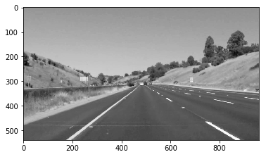
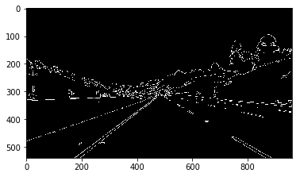
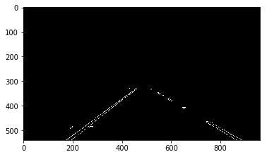
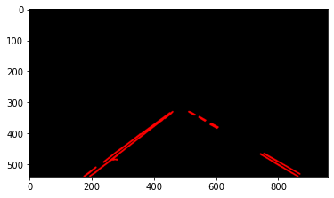
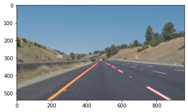
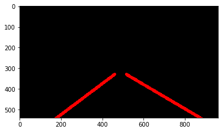
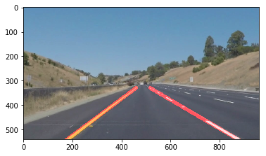

# **Finding Lane Lines on the Road** 

Overview
---

When we drive, we use our eyes to decide where to go.  The lines on the road that show us where the lanes are act as our constant reference for where to steer the vehicle.  Naturally, one of the first things we would like to do in developing a self-driving car is to automatically detect lane lines using an algorithm.

In this project you will detect lane lines in images using Python and OpenCV.  OpenCV means "Open-Source Computer Vision", which is a package that has many useful tools for analyzing images.  

To meet specifications in the project, take a look at the requirements in the [project rubric](https://review.udacity.com/#!/rubrics/322/view)

The Final Code and demonstration on how to approach this problem, please refer to [P1.ipynd](./P1.ipynb). If you want to view without Jupyter Notebook, here is a markdown version [P1.md](./P1_md/P1.md)

Prerequisites
---

**Step 1:** Set up the [CarND Term1 Starter Kit](https://classroom.udacity.com/nanodegrees/nd013/parts/fbf77062-5703-404e-b60c-95b78b2f3f9e/modules/83ec35ee-1e02-48a5-bdb7-d244bd47c2dc/lessons/8c82408b-a217-4d09-b81d-1bda4c6380ef/concepts/4f1870e0-3849-43e4-b670-12e6f2d4b7a7) if you haven't already.

**Step 2:** Open the code in a Jupyter Notebook

You will complete the project code in a Jupyter notebook.  If you are unfamiliar with Jupyter Notebooks, check out <A HREF="https://www.packtpub.com/books/content/basics-jupyter-notebook-and-python" target="_blank">Cyrille Rossant's Basics of Jupyter Notebook and Python</A> to get started.

Jupyter is an Ipython notebook where you can run blocks of code and see results interactively.  All the code for this project is contained in a Jupyter notebook. To start Jupyter in your browser, use terminal to navigate to your project directory and then run the following command at the terminal prompt (be sure you've activated your Python 3 carnd-term1 environment as described in the [CarND Term1 Starter Kit](https://github.com/udacity/CarND-Term1-Starter-Kit/blob/master/README.md) installation instructions!):

`> jupyter notebook`

A browser window will appear showing the contents of the current directory.  Click on the file called "P1.ipynb".  Another browser window will appear displaying the notebook.  Follow the instructions in the notebook to complete the project.  

Code Walk-through
---
To achieve the final result shown in the first picture, the following image processing procedures are used:
* Use Opencv function [`cv2.cvtColor()`](https://docs.opencv.org/3.4/de/d25/imgproc_color_conversions.html) to convert RGB image to Grayscale.
    
    
 
* Use the Grayscale image to perform [canny edge detection](https://en.wikipedia.org/wiki/Canny_edge_detector). This also uses OpenCV function called [`cv2.Canny()`](https://docs.opencv.org/3.4/da/d5c/tutorial_canny_detector.html)

    
    
* Apply a mask :mask: to only include the lane line and ignore all other edges

    

* Apply [Hough Line Transformation](https://opencv-python-tutroals.readthedocs.io/en/latest/py_tutorials/py_imgproc/py_houghlines/py_houghlines.html) from the Canny edge detection. Transfer the edge dots to lines. This uses [`cv2.HoughLinesP()`](https://docs.opencv.org/3.4/d9/db0/tutorial_hough_lines.html)    
    
    
* Apply averaging method of your design to extrapolate previous many lines into two coherent lines to represent our lane lines.
    
    
    
Now it ready to apply this logic to process driving videos. In order to get a stable and not jumping around output, previous frames lines is required. If the current lines has big difference of location and slopes compare to the previous lines' location, the current line should not be accumulated to the result.
Below is a output video showing only result of hugh lines and no accumulated average calculations

Below video shown the lane lines after averaging previous results:

